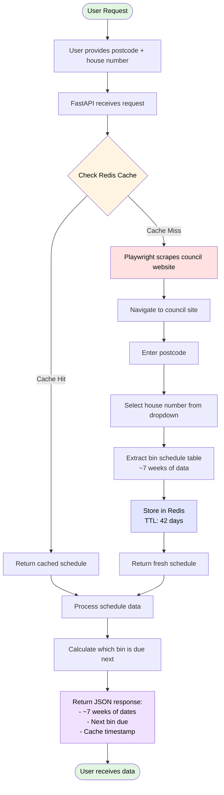

# Bin Reminder Project 

Become your street's "Binfluencer" - no longer relying on looking out the window to check what your neighbour has put out! Use this simple app to check which bin it is, automating the manual lookup on the Fife Council website.

## Problem

- Single user wants to check which bin to put out
- Council website requires postcode → house number → displays table with bin schedule
- Automate retrieval to avoid manual lookup each time

## Architecture Overview



## Design Principles

- **No user accounts** - just query by postcode/house number
- **No email notifications** - user checks when they want
- **No scheduler** - on-demand data retrieval
- **No PostgreSQL** - stateless application

## Tech Stack

| Technology | Purpose |
|------------|---------|
| Python with UV | Dependency management |
| FastAPI | REST API backend |
| Playwright | Web scraping with real browser interactions |
| Redis | Caching bin schedules |
| Docker & Docker Compose | Containerization |
| GitHub Actions | CI/CD pipeline |
| pytest, ruff, mypy | Testing and code quality |

## Services

Two containers:

1. **App Service** - FastAPI + Playwright scraper
2. **Redis** - Cache layer

## Data Flow

1. User provides postcode + house number via API
2. App checks Redis cache first (key: `bin_schedule:{postcode}:{house_number}`)
3. **Cache hit:** Return cached schedule immediately
4. **Cache miss:** Scrape council site → store in Redis → return schedule
5. Response includes ~7 weeks of bin collections

## Caching Strategy

| Setting | Value |
|---------|-------|
| TTL | 42 days (6 weeks) |
| Key format | `bin_schedule:{postcode}:{house_number}` |
| Value | JSON with ~7 weeks of bin collection dates/types |

**Rationale:**
- Council provides ~7 weeks of data, refresh with 1-week buffer
- Each address scraped approximately once every 6 weeks
- Minimal load on council website
- Always have fresh data with upcoming dates

## API Response

Returns:
- All bin collection dates (~7 weeks)
- Which bin is due next (calculated from current date)
- Cache timestamp (when data was last fetched)

## Bin Types

| Colour | Type |
|--------|------|
| Green | Cans and Plastics |
| Brown | Food and Garden Waste |
| Blue | Landfill |
| Grey | Paper and Cardboard |

**Note:** Blue and brown bins can go out on the same day. The frontend displays these with a split colour gradient. Green and grey bins always go out separately.

## Optional Features

- Manual cache refresh endpoint (for testing or forced updates)
- Health check endpoint
- API documentation (auto-generated by FastAPI)

## Frontend

A mobile-first static HTML page served by FastAPI featuring:
- Responsive design optimized for mobile devices
- Address saved in localStorage for convenience
- Next bin prominently displayed with colour coding
- Always shows at least one upcoming collection, plus any others within 7 days
- Split colour display when blue and brown bins share a collection day
- "Change Address" option to clear saved data

## CI/CD Pipeline

1. Lint and type check (ruff, mypy)
2. Run tests with coverage (pytest)
3. Build Docker images
4. Push to container registry

## Testing Strategy

- **Integration tests** - Real Playwright scraping (run less frequently)
- **Unit tests** - Mocked/recorded responses (run on every commit)
- Use pytest-recording or VCR.py for response caching in tests

## Project Structure

```
bin-reminder/
├── src/
│   ├── main.py           # FastAPI app
│   ├── scraper.py        # Playwright scraper
│   ├── cache.py          # Redis operations
│   ├── models.py         # Data models
│   └── static/
│       └── index.html    # Frontend page
├── tests/
├── docker-compose.yml
├── Dockerfile
├── pyproject.toml
├── .github/workflows/
└── README.md
```

## Prerequisites

- Docker and Docker Compose

## Getting Started

1. Clone the repository
2. Run `docker compose up --build`
3. Open http://localhost:8001 to use the Bin Reminder app

**Other URLs:**
- http://localhost:8001/docs - API documentation (Swagger UI)
- http://localhost:8081 - Redis Commander (view and manage cached data)

## Using the App

1. Enter your **postcode** (must be a Fife area code: KY, DD, or FK)
2. Enter your **address** (e.g., "10 High Street")
3. Click **Check Bins**

The app will show:
- **Next Collection** - your next bin day with colour coding
- **Upcoming** - the following collection, plus any others within 7 days

Your address is saved in your browser, so you won't need to enter it again next time.

Click **Change Address** to clear the saved address and enter a new one.

## API Endpoints

| Endpoint | Method | Description |
|----------|--------|-------------|
| `/health` | GET | Health check |
| `/schedule?postcode=XX&address=XX` | GET | Get bin schedule |
| `/cache` | DELETE | Clear cache (dev only) |

## Environment Variables

| Variable | Default | Description |
|----------|---------|-------------|
| `REDIS_HOST` | `localhost` | Redis server hostname |
| `HEADLESS` | `true` | Run browser headlessly |

## Development Approach

- Move slowly and deliberately through each component
- Explain architectural decisions before implementing
- I write code first, Claude reviews and guides
- Focus on understanding over speed
- Break tasks into small, digestible chunks
- Pause for questions and explanations

## Skills Demonstrated

- Modern Python development (FastAPI, UV, type hints)
- Web scraping with browser automation
- Caching strategies and performance optimization
- REST API design
- Docker containerization
- CI/CD best practices
- Clean code structure and testing