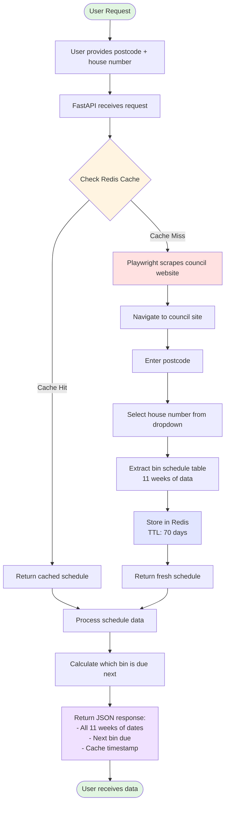

# Bin Reminder Project

A simple API to check which bin to put out, automating the manual lookup on the council website.

## Problem

- Single user wants to check which bin to put out
- Council website requires postcode → house number → displays table with bin schedule
- Automate retrieval to avoid manual lookup each time

## Architecture Overview



## Design Principles

- **No user accounts** - just query by postcode/house number
- **No email notifications** - user checks when they want
- **No scheduler** - on-demand data retrieval
- **No PostgreSQL** - stateless application

## Tech Stack

| Technology | Purpose |
|------------|---------|
| Python with UV | Dependency management |
| FastAPI | REST API backend |
| Playwright | Web scraping with real browser interactions |
| Redis | Caching bin schedules |
| Docker & Docker Compose | Containerization |
| GitHub Actions | CI/CD pipeline |
| pytest, ruff, mypy | Testing and code quality |

## Services

Two containers:

1. **App Service** - FastAPI + Playwright scraper
2. **Redis** - Cache layer

## Data Flow

1. User provides postcode + house number via API
2. App checks Redis cache first (key: `bin_schedule:{postcode}:{house_number}`)
3. **Cache hit:** Return cached schedule immediately
4. **Cache miss:** Scrape council site → store in Redis → return schedule
5. Response includes next 11 weeks of bin collections

## Caching Strategy

| Setting | Value |
|---------|-------|
| TTL | 70 days (10 weeks) |
| Key format | `bin_schedule:{postcode}:{house_number}` |
| Value | JSON with 11 weeks of bin collection dates/types |

**Rationale:**
- Council provides 11 weeks of data, refresh with 1-week buffer
- Each address scraped approximately once every 10 weeks
- Minimal load on council website
- Always have fresh data with upcoming dates

## API Response

Returns:
- All bin collection dates (next 11 weeks)
- Which bin is due next (calculated from current date)
- Cache timestamp (when data was last fetched)

## Optional Features

- Manual cache refresh endpoint (for testing or forced updates)
- Health check endpoint
- API documentation (auto-generated by FastAPI)

## Frontend Options

| Option | Description |
|--------|-------------|
| PWA | React/Vue for user-friendly interface |
| API only | FastAPI auto-docs (simpler, focus on backend) |

## CI/CD Pipeline

1. Lint and type check (ruff, mypy)
2. Run tests with coverage (pytest)
3. Build Docker images
4. Push to container registry

## Testing Strategy

- **Integration tests** - Real Playwright scraping (run less frequently)
- **Unit tests** - Mocked/recorded responses (run on every commit)
- Use pytest-recording or VCR.py for response caching in tests

## Project Structure

```
bin-reminder/
├── src/
│   ├── main.py           # FastAPI app
│   ├── scraper.py        # Playwright scraper
│   ├── cache.py          # Redis operations
│   └── models.py         # Data models
├── tests/
├── docker-compose.yml
├── Dockerfile
├── pyproject.toml
├── .github/workflows/
└── README.md
```

## Prerequisites

- Docker and Docker Compose

## Getting Started

1. Clone the repository
2. Run 'docker compose up --build'
3. Open http://localhost:8000/docs for API documentation
4. Open http://localhost:8081 for Redis Commander (view and manage cached data)

## API Endpoints

| Endpoint | Method | Description |
|----------|--------|-------------|
| `/health` | GET | Health check |
| `/schedule?postcode=XX&address=XX` | GET | Get bin schedule |
| `/cache` | DELETE | Clear cache (dev only) |

## Environment Variables

| Variable | Default | Description |
|----------|---------|-------------|
| `REDIS_HOST` | `localhost` | Redis server hostname |
| `HEADLESS` | `true` | Run browser headlessly |

## Development Approach

- Move slowly and deliberately through each component
- Explain architectural decisions before implementing
- I write code first, Claude reviews and guides
- Focus on understanding over speed
- Break tasks into small, digestible chunks
- Pause for questions and explanations

## Skills Demonstrated

- Modern Python development (FastAPI, UV, type hints)
- Web scraping with browser automation
- Caching strategies and performance optimization
- REST API design
- Docker containerization
- CI/CD best practices
- Clean code structure and testing