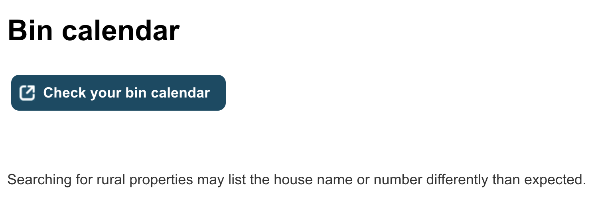
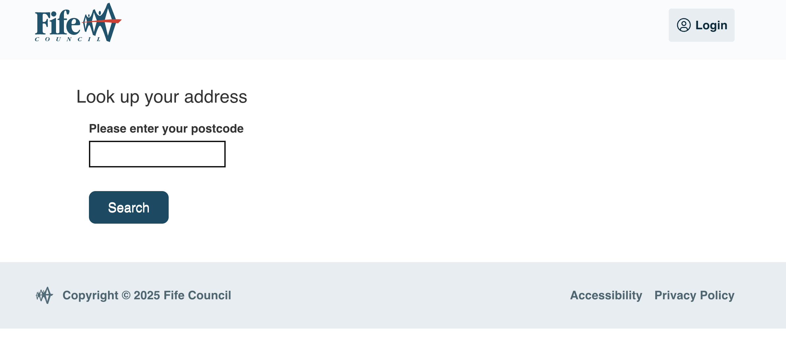
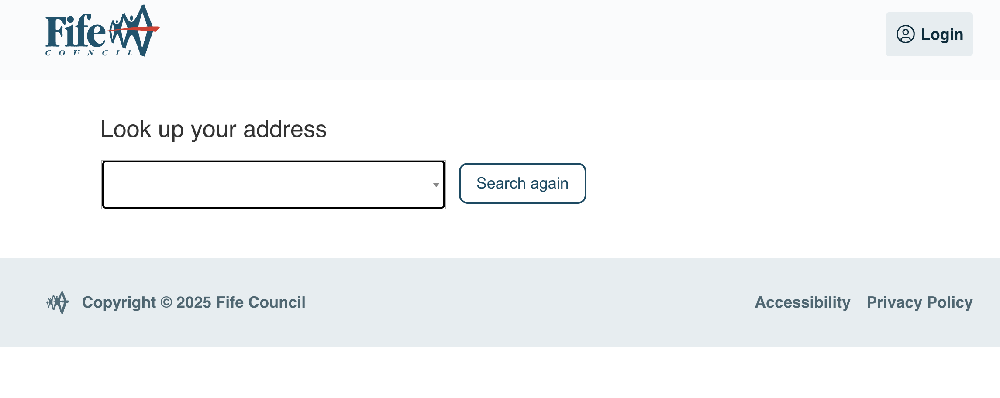
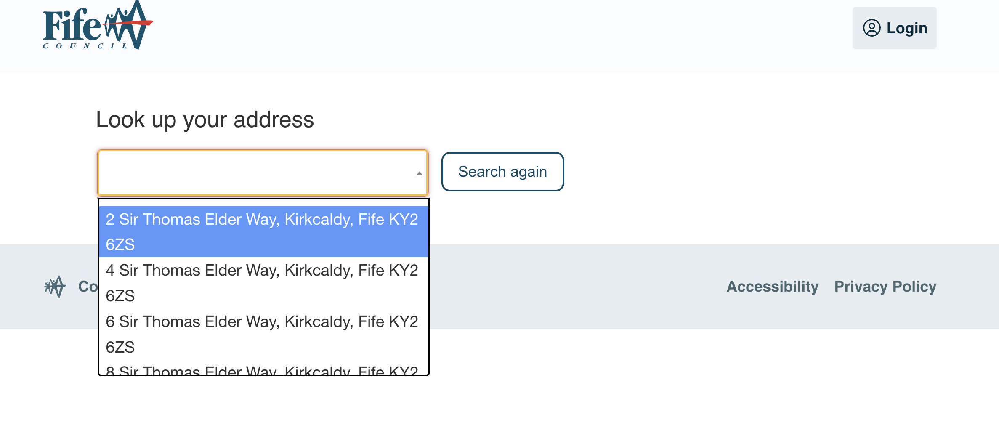
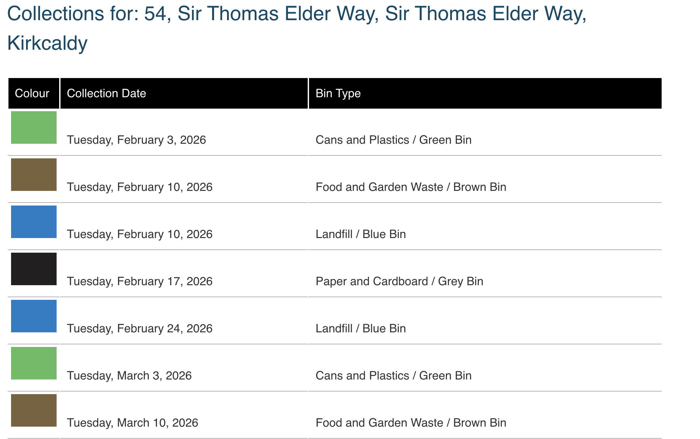

# Council Website Scraping Notes

## URL Discovery

| URL | Purpose | Required? |
|-----|---------|-----------|
| https://www.fife.gov.uk/services/bin-calendar | Landing page | No (can skip) |
| https://fife.portal.uk.empro.verintcloudservices.com/site/fife/request/bin_calendar | Direct entry point | Yes - start here |

**Tested:** Direct URL works in incognito - no session/cookies required from landing page.

---

## Step-by-Step Flow

### Step 1: Landing Page (SKIPPED)



- "Check your bin calendar" button navigates to the postcode entry page
- **We skip this step** - go directly to the portal URL

---

### Step 2: Postcode Entry



**Page shows:** "Look up your address" / "Please enter your postcode"

| Element | Type | ID | Notes |
|---------|------|-----|-------|
| Postcode input | `<input>` | `dform_widget_ps_45M3LET8_txt_postcode` | Text field for postcode |
| Search button | `<button>` | `dform_widget_ps_3SHSN93_searchbutton` | Navigates to address selection |

**Action:** Enter postcode → Click "Search"

---

### Step 3: Address Selection




**Page shows:** "Look up your address" with dropdown list filtered by postcode

| Element | Type | ID | Notes |
|---------|------|-----|-------|
| Address dropdown | Select2 widget | `select2-dform_widget_ps_3SHSN93_id-container` | Uses Select2 library |

**Action:** Click dropdown → Scroll to find house → Click to select

**Note:** Uses Select2 library (not a native `<select>`) - may need special handling in Playwright.

---

### Step 4: Results Page



**Table structure:**

| Element | Type | ID | Notes |
|---------|------|-----|-------|
| Results table | `<div>` | `dform_widget_table_tab_collections` | Contains all rows |
| Table rows | `<div>` | class `dform_tr` | One per collection |
| Colour cell | `<div>` | `data-name="colour"` | Contains `` with bin colour |
| Date cell | `<div>` | `data-name="date"` | e.g., "Tuesday, February 3, 2026" |
| Type cell | `<div>` | `data-name="type"` | e.g., "Cans and Plastics / Green Bin" |

**Columns:**
1. **Colour** - Image showing bin colour (green, brown, blue, grey)
2. **Collection Date** - Full date format: "Tuesday, February 3, 2026"
3. **Bin Type** - Description: "Cans and Plastics / Green Bin"

**Data returned:** 11 rows (11 weeks of collections)

---

## Bin Types Reference

These are the image filenames used on the council website (hosted on their CDN). Useful for identifying bin types when parsing.

| Colour | Council Image URL | Alt Text | Type |
|--------|-------------------|----------|------|
| Green | `cdn.../bin_green.png` | "Green" | Cans and Plastics |
| Brown | `cdn.../bin_brown.png` | "Brown" | Food and Garden Waste |
| Blue | `cdn.../bin_blue.png` | "Blue" | Landfill |
| Grey | `cdn.../bin_grey.png` | "Grey" | Paper and Cardboard |

**Note:** We can identify bin colour from either the image filename or the `alt` attribute on the `` tag.

---

## Quirks / Things to Watch For

| Concern | Status |
|---------|--------|
| Loading spinners | None |
| Pop-ups or modals | None |
| Dynamic page updates | No |
| CAPTCHA or bot detection | None |
| Select2 dropdown | Yes - needs special handling |

---

## Sample Data (from results table)

```
Date                        | Bin Type
----------------------------|----------------------------------
Tuesday, February 3, 2026   | Cans and Plastics / Green Bin
Tuesday, February 10, 2026  | Food and Garden Waste / Brown Bin
Tuesday, February 10, 2026  | Landfill / Blue Bin
Tuesday, February 17, 2026  | Paper and Cardboard / Grey Bin
Tuesday, February 24, 2026  | Landfill / Blue Bin
Tuesday, March 3, 2026      | Cans and Plastics / Green Bin
Tuesday, March 10, 2026     | Food and Garden Waste / Brown Bin
Tuesday, March 10, 2026     | Landfill / Blue Bin
Tuesday, March 17, 2026     | Paper and Cardboard / Grey Bin
Tuesday, March 24, 2026     | Food and Garden Waste / Brown Bin
Tuesday, March 24, 2026     | Landfill / Blue Bin
```

---

## Playwright Strategy Summary

1. Navigate to direct URL
2. Fill postcode input (`#dform_widget_ps_45M3LET8_txt_postcode`)
3. Click search button (`#dform_widget_ps_3SHSN93_searchbutton`)
4. Wait for address dropdown to load
5. Interact with Select2 dropdown to select address
6. Wait for results table to appear
7. Extract all rows from `#dform_widget_table_tab_collections`
8. Parse date and bin type from each row
